# Awesome Documentation of Project 14 Experience Continuous Integration With Jenkins | Ansible | Artifactory | Sonarqube | PHP

## Project Objective

In this project, I will be Configuring a CI/CD Pipeline using Jenkins and Ansible to automate the integration and deployment of a PHP Based Application.

> To fully grasps the concept of the CI/CD process, the glossary of key DevOps tools and concept have been outlined below.

1.  **CONTINUOUS INTEGRATION**:
    Continuous Integration (CI) is a practice of merging all developers’ working copies to a shared mainline (e.g., Git Repository or some other version control system) several times per day. Frequent merges reduce chances of any conflicts in code and allow to run tests more often to avoid massive rework if something goes wrong. This principle can be formulated as Commit early, push often.

    The general workflow of CI process Include

    - **Run tests Locally:** Test Driven Development is commonly used in combination with CI before developers commit their work to avoid one developers work-in-progress code from breaking other developers copy of the code base.
    - **Compile Code in CI**:after codes have been tested locally, developers commit and push their work to a central repository, a dedicated CI server picksup the code and runs the build there.
    - **Run further test in CI**: It is important to run the unit-tests on the CI server there are other kinds of tests and code analysis that can be run using CI server. These are extremely critical to determining the overall quality of code being developed, how it interacts with other developers’ work, and how vulnerable it is to attacks. A CI server can use different tools for Static Code Analysis, Code Coverage Analysis, Code smells Analysis, and Compliance Analysis. In addition, it can run other types of tests such as Integration and Penetration tests. Other tasks performed by a CI server include production of code documentation from the source code and facilitate manual quality assurance (QA) testing processes
    - **Deploy an Artifact from CI**: Continuous Delivery which ensures that software checked into the mainline is always ready to be deployed to users. The deployment here is manually triggered after certain QA tasks are passed successfully. There is another CD known as Continuous Deployment which is also about deploying the software to the users, but rather than manual, it makes the entire process fully automated. Thus, Continuous Deployment is just one step ahead in automation than Continuous Delivery.

    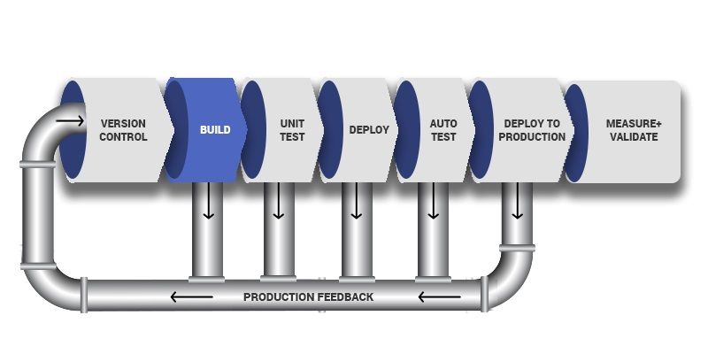

1.  13 DevOps Success Metrics:

    - **Deployment frequency:** Tracks how often deployments are done. The goal is to do more smaller deployments as often as possible. Reducing the size of deployments makes it easier to test and release. `darey.io` suggests counting both production and non-production deployments separately. How often you deploy to QA or pre-production environments is also important. You need to deploy early and often in QA to ensure enough time for testing.

    - **Lead time:** Lead time is the amount of time that occurs between starting on a work item until it is deployed. This helps you know that if you started on a new work item today, how long would it take on average until it gets to production.

    - **Customer tickets:** The best and worst indicator of application problems is customer support tickets and feedback. The last thing you want is your users reporting bugs or having problems with your software. Because of this, customer tickets also serve as a good indicator of application quality and performance problems.

    - **Percentage of passed automated tests:** To increase velocity, it is highly recommended that the development team makes extensive usage of unit and functional testing. Since DevOps relies heavily on automation, tracking how well automated tests work is a good DevOps metrics. It is good to know how often code changes break tests.

    - **Defect escape rate:** If you want to ship code fast, you need to have confidence that you can find software defects before they get to production. Defect escape rate is a great DevOps metric to track how often those defects make it to production.

    - **Availability:** The last thing we ever want is for our application to be down. Depending on the type of application and how we deploy it, we may have a little downtime as part of scheduled maintenance. It is highly recommended to track this metric and all unplanned outages. Most software companies build status pages to track this.

    - **Service level agreements:** Most companies have some service level agreement (SLA) that they promise to the customers. It is also important to track compliance with SLAs. Even if there are no formally stated SLAs, there probably are application non-functional requirements or expectations to be met.

    - **Failed deployments:** We all hope this never happens, but how often do our deployments cause an outage or major issues for the users? Reversing a failed deployment is something we never want to do, but it is something you should always plan for. If you have issues with failed deployments, be sure to track this metric over time. This could also be seen as tracking **_Mean Time To Failure (MTTF)_**.

    - **Error rates:** Tracking error rates within the application is super important. Not only they serve as an indicator of quality problems, but also ongoing performance and uptime related issues. In software development, errors are also known as exceptions, and proper exception handling is critical. If they are not handled nicely, we can figure it out while monitoring the rate of errors.

      - **Bugs** – Identify new exceptions being thrown in the code after a deployment

      - **Production issues** – Capture issues with database connections, query timeouts, and other related issues

      Presenting error rate metrics like this simply gives greater insights into where to focus attention.

    - **Application usage & traffic:** After a deployment, we want to see if the number of transactions or users accessing our system looks normal. If we suddenly have no traffic or a giant spike in traffic, something could be wrong. An attacker may be routing traffic elsewhere, or initiating a DDOS attack

    - **Application performance:** Before we even perform a deployment, we should configure monitoring tools like `Retrace`, `DataDog`, `New Relic`, or `AppDynamics` to look for performance problems, hidden errors, and other issues. During and after the deployment, we should also look for any changes in overall application performance and establish some benchmarks to know when things deviate from the norm.

      > It might be common after a deployment to see major changes in the usage of specific SQL queries, web service or HTTP calls, and other application dependencies. These monitoring tools can provide valuable visualizations.

    - **Mean time to detection (MTTD):** When problems happen, it is important that we identify them quickly. The last thing we want is to have a major partial or complete system outage and not know about it. Having robust application monitoring and good observability tools in place will help us detect issues quickly. Once they are detected, we also must fix them quickly!

    - **Mean time to recovery (MTTR):** This metric helps us track how long it takes to recover from failures. A key metric for the business is keeping failures to a minimum and being able to recover from them quickly. It is typically measured in hours and may refer to business hours, not calendar hours.

## Prerequisites

1. AWS virtual machine for the project which includes:

   - **Nginx Server**: Reverse proxy server

   - **Jenkins server**: For CI/CD Pipeline with atleast a t2.medium instance type, Ubuntu 20.04 and Security group should be open to allow port 8080
   - **SonarQube server**: For Code quality analysis. with atleast a t2.medium instance type, Ubuntu 20.04 and Security group should be open to port 9000
   - **Artifactory server**: Artifact binary repository where the build result process is stored. Atleast a t2.medium Instance type and Security group should be open to port 8082

   - **Database server**: Database server for the Todo application

   - **Todo webserver**: To host the Todo web application.

## Quick Start- Set Up

- This project is architecture has two major repositories with each repository containing its own CI/CD pipeline written in a Jenkinsfile

  - [**ansible-config-mgt** ](https://github.com/Kingkellee/ansible-config-mgt)
  - [**PHP-todo**](https://github.com/Kingkellee/php-todo)

- Refactor the [**ansible-config-mgt** ](https://github.com/Kingkellee/ansible-config-mgt) Inventory to Look like This;

```
├── ci
├── dev
├── pentest
├── pre-prod
├── prod
├── sit
└── uat
```

- Our CI `inventory` should contain the following server

```
[jenkins]
<Jenkins-Private-IP-Address>

[nginx]
<Nginx-Private-IP-Address>

[sonarqube]
<SonarQube-Private-IP-Address>

[artifact_repository]
<Artifact_repository-Private-IP-Address>
```

- Our Dev Inventory File will contain the Following Severs

```


[tooling]
<Tooling-Web-Server-Private-IP-Address>

[todo]
<Todo-Web-Server-Private-IP-Address>

[nginx]
<Nginx-Private-IP-Address>

[db:vars]
ansible_user=ec2-user
ansible_python_interpreter=/usr/bin/python

[db]
<DB-Server-Private-IP-Address>
```

## Ansible Roles for CI Environment

- To Configure `SonarQube` and `Artifactory`, use `ansible-galaxy` to install this configuration into our ansible roles, it will be used to run against the `sonarqube server and artifactory server`.

## Configuring Ansible For Jenkins Deployment

- Configure Jenkins server with an Ubuntu 20.04 Instance, Instance type t2.medium
  see [Project 9](https://github.com/Kingkellee/dareyio-pbl/blob/master/project9.md) on how to set up Jenkins
- Connect the Jenkins instance on VSCode via SSH and set up SSH-agent to ensure ansible get the private key required to connect to other servers:

```
eval `ssh-agent -s`
ssh-add <path-to-private-key>
```

- Navigate to Jenkins Url
- Click on `Manage Jenkins` click on Plugins
- In `Available` Search and Install `Blue Ocean` Jenkins Plugin
- Create a new Pipeline
  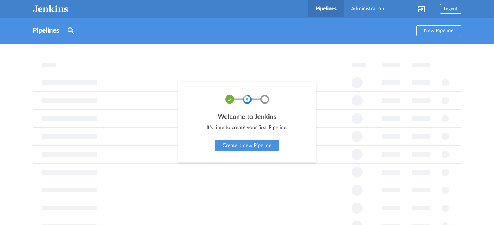
- Select Github
  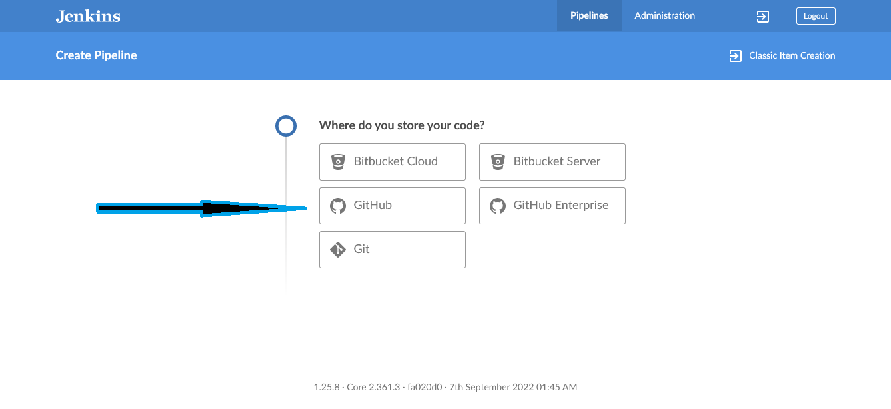
- Connect Jenkins with Github

  - Click on `Create an Access Token Here`
    ![create-access-token]
  - In github, click on `settings`, click on `developers settings`, `click on Tokens` and `generate new token`
    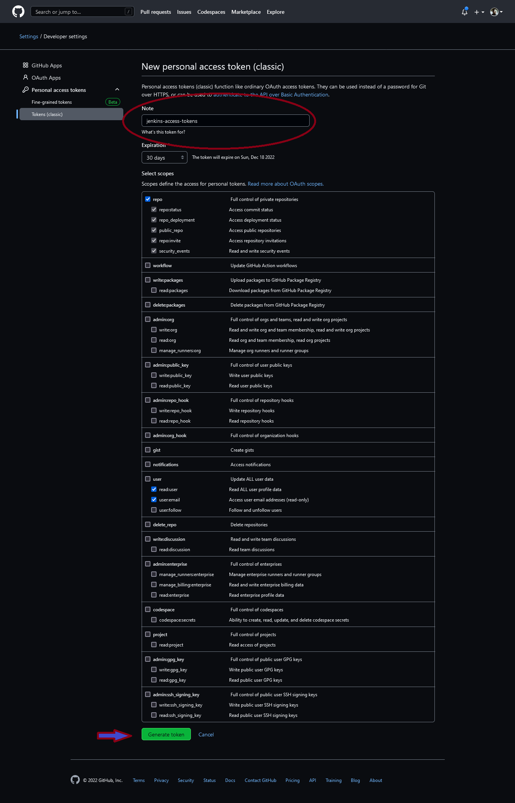

- Copy Access Tken
  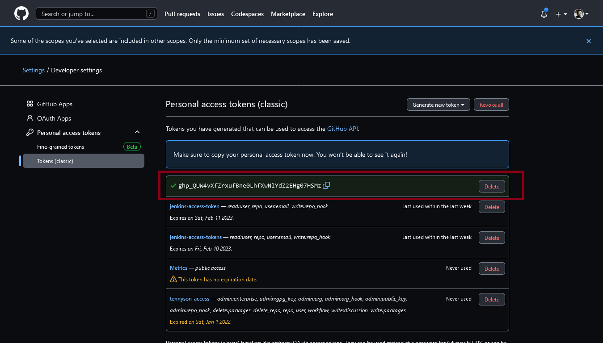

- Paste the Token and Connect
  ![Paste the Token and connect Github]
  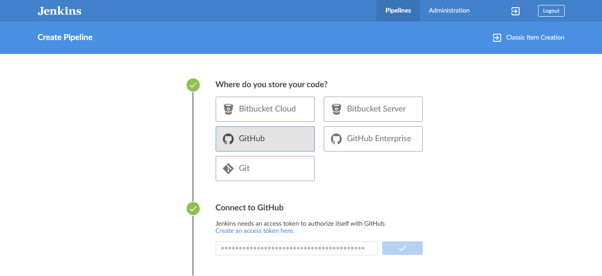
- Create a new Pipeline
  Choose a repository from the
  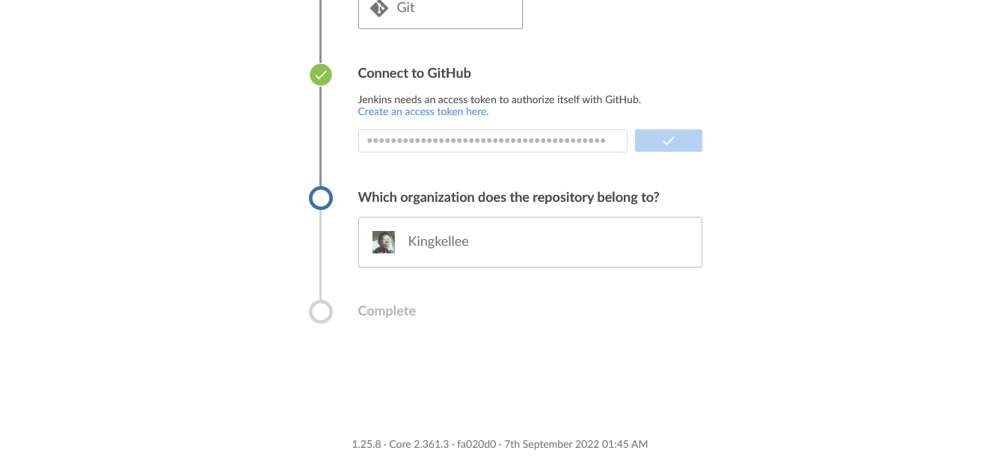

Our Repository may not show on Blue Ocean at this point because we do not have a Jenkinsfile in the Ansible

- Click on the Administraton Tab to exit Blue Ocean Console and Create Deploy/Jenkinsfile in the root folder of our directory.
  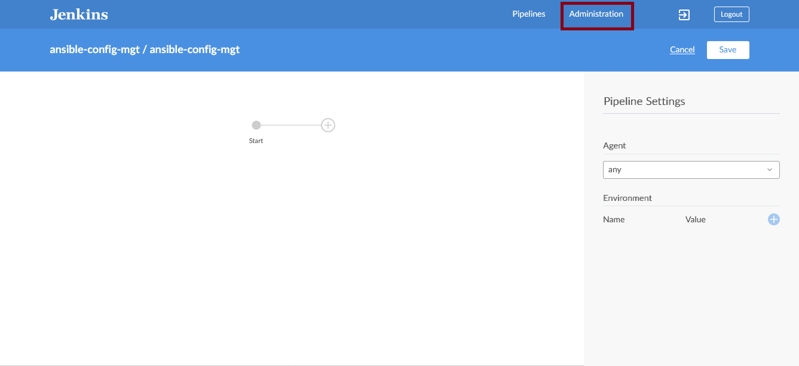

- Here is our newly created Pipeline, it takes the name of our Git repository
  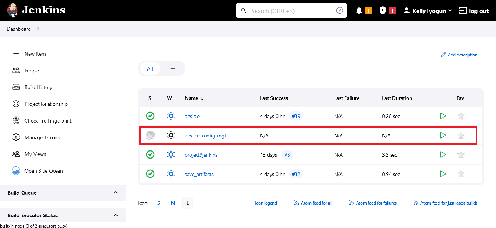

### Create Our Jenkinsfile

- Inside the Ansible project, create a new directory deploy and start a new file Jenkinsfile inside the directory.

```
mkdir deploy
```

```
cd deploy

touch Jenkinsfile
```

- Add the code snippet below to start building the Jenkinsfile gradually. This pipeline currently has just one stage called Build and the only thing we are doing is using the shell script module to echo Building Stage

```
pipeline {
    agent any

  stages {
    stage('Build') {
      steps {
        script {
          sh 'echo "Building Stage"'
        }
      }
    }
    }
}
```

- Go back into Ansibile pipeline in Jenkins, `Select Configure`
  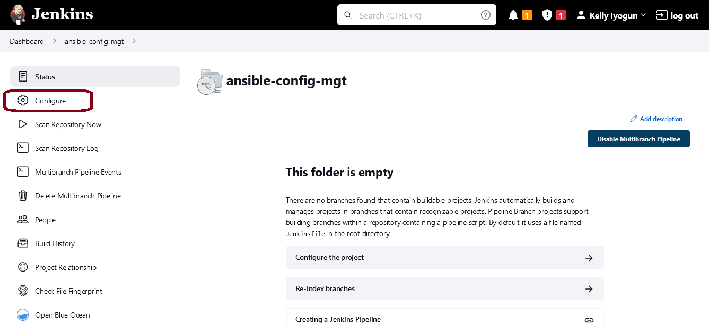

- Scroll down to Build Configuration section and specify the location of the Jenkinsfile at `deploy/Jenkinsfile`
  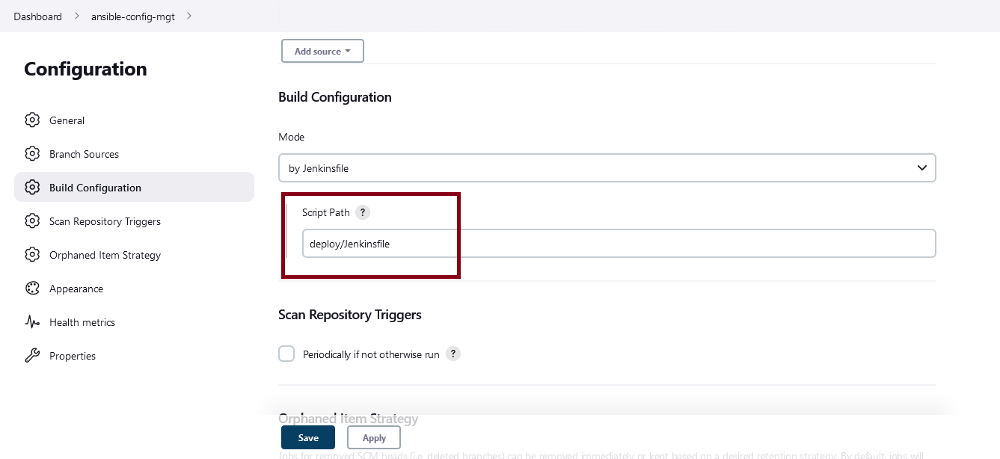

- Go Back to the pipeline again and Click on `Build Now`

  > This will trigger a build and we will be able to see the effect of our basic Jenkinsfile configuration by going through the console output of the build.

- To trigger the Build from Blue Ocean Interface, Click on`Open Blue Ocean
- Select your Project
- Click on the play button against the branch
- Note if there were more than one branch in GitHub, Jenkins would have scanned the repository to discover them all and we would have been able to trigger a build for each branch.

  - to see this in action; we crete a new branch

  ```
  git checkout main -b feature/jenkinspipeline-stages
  ```

  - add another stage called Test. Paste the code snippet below and push the new changes to GitHub.

  ```
      pipeline {
      agent any

  stages {
      stage('Build') {
      steps {
          script {
          sh 'echo "Building Stage"'
          }
      }
      }

      stage('Test') {
      steps {
          script {
          sh 'echo "Testing Stage"'
          }
      }
      }
      }
  }
  ```

  - To make your new branch show up in Jenkins, we need to tell Jenkins to scan the repository. Click on the `Administration` button
  - Navigate to the Ansible project and click on "Scan repository now"
    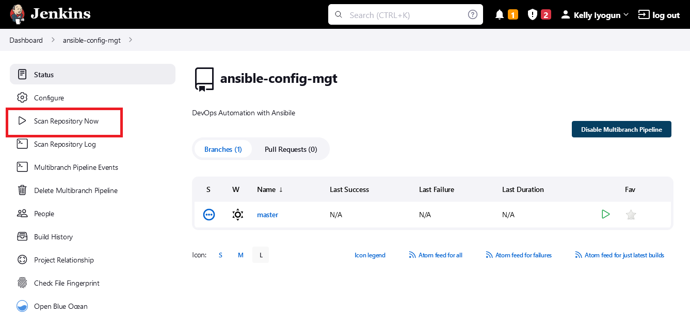
  - Refresh the page and both branches will start building automatically. You can go into Blue Ocean and see both branches there too.
    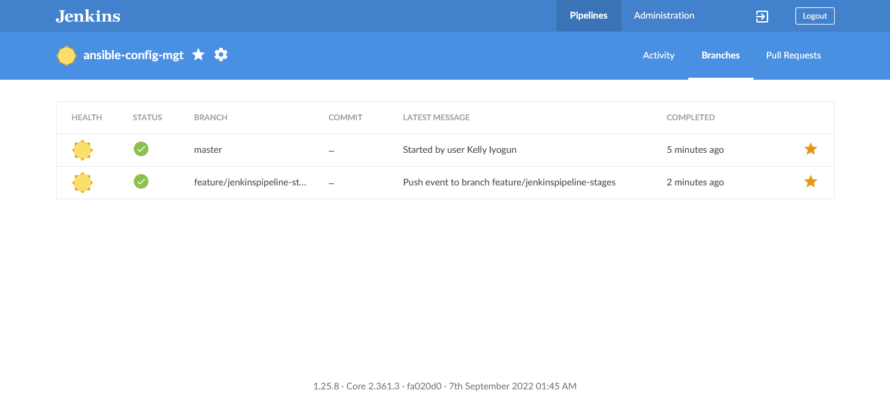
    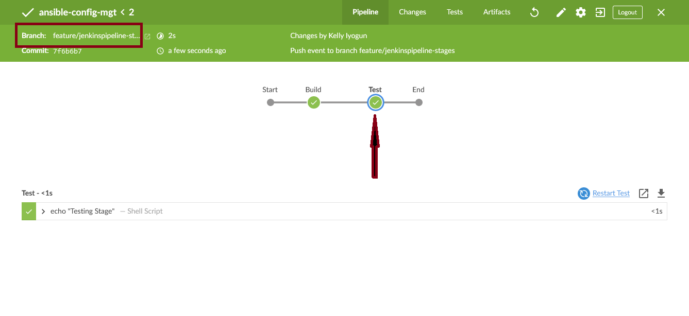

  #### QUICK TASK

  - Create a pull request to merge the latest code into the main branch
  - After merging the PR, go back into your terminal and switch into the main branch.
  - Pull the latest change.
  - Create a new branch, add more stages into the Jenkins file to simulate below phases. (Just add an echo command like we have in build and test stages)
    1. Package
    1. Deploy
    1. Clean up


```
git checkout feature/jenkinspipeline-stages -b feature/optional-task
```

- Verify in Blue Ocean that all the stages are working
  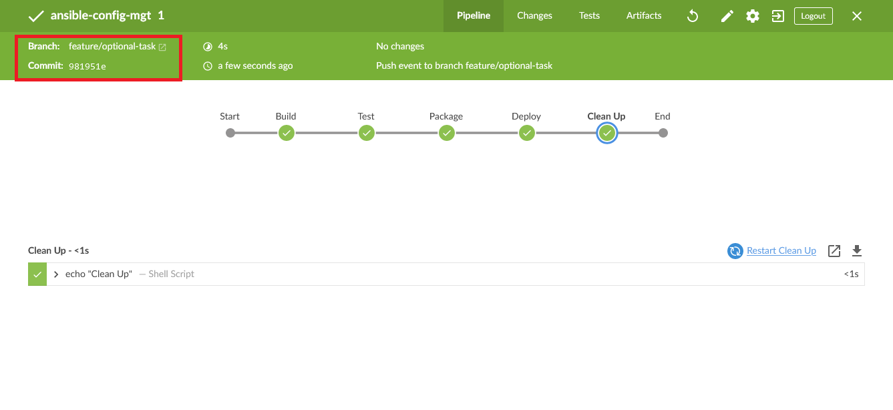
- merge your feature branch to the main/master branch your main/master branch should have a successful pipeline like this in blue ocean
  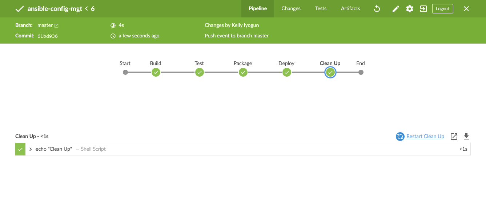

## Running Ansible Playbook from Jenkins

- Install Ansible in Jenkins

```
sudo apt install ansible
```

- Install Ansible plugin in Jenkins UI
  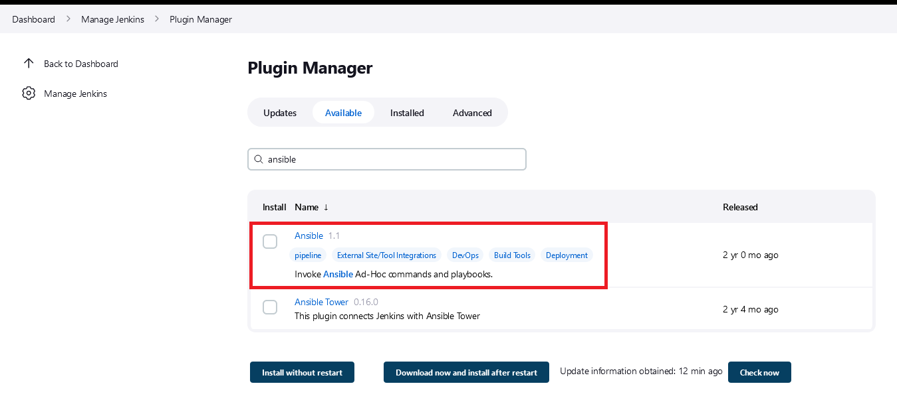

- In `Manage Jenkins`, Click on Global Tool Configuration and add path to ansible executable
  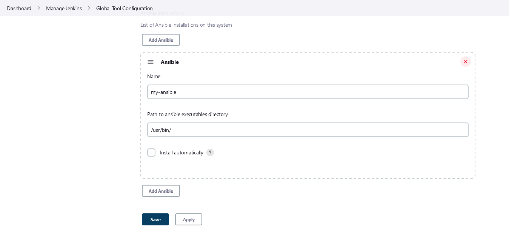

- In the deploy folder, create a file name ansible.cfg file and copy the content below inside the file
  

> By default when we install ansible, the default configuration file is in /etc/ansible/ansible.cfg, now we are creating our own config file to define our default value on how we want the ansible to run, variables to use etc.

> Jenkins works with file inside the workspace folder.

> The role path is not specified in the ansible.cfg file we created, it will be defined in the Jenkinsfile.

> Jenkins needs to export the ANSIBLE_CONFIG environment variable, which must be declared globally and specifies where ansible.cfg file is

```
environment {
  ANSIBLE_CONFIG="${WORKSPACE}/deploy/ansible.cfg"
 }
```

- To run Ansible playbook via the Jenkinsfile, Click on `Dashoard`

  - Click on `Manage Jenkins`
  - Click on `Manage Credentials`
  - In `Credentials` click on `Add Credentials`. Fill in the blanks, by copying and pasting the content of the ptivate key and username (ubuntu or ec-user) To ensure our ansible run against `inventory/dev`

- Create Jenkinsfile from scratch. (Delete all you currently have in there and start all over to get Ansible to run successfully)
  > Note: Ensure that Ansible runs against the Dev environment successfully.


- Update the inventory/dev with nginx and db server

- Push the code with the new updates in the Jenkinsfile.

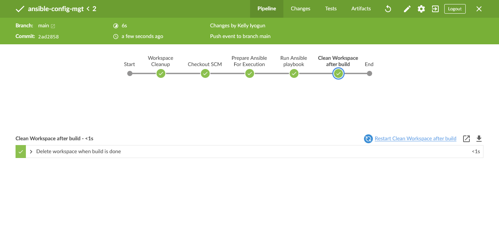

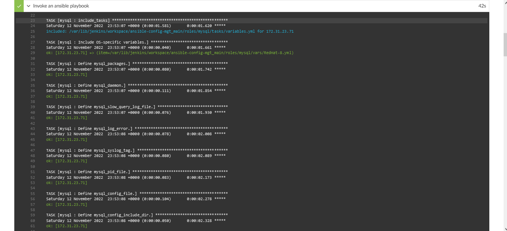
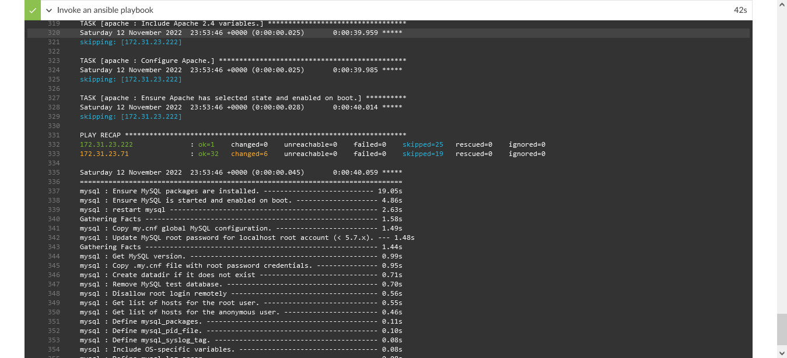

- To deploy to other environments,manually updating the Jenkinfile is not an option, we will need to use parameters. Update Jenkinsfile to introduce parameterization. Below is just one parameter. It has a default value in case if no value is specified at execution. It also has a description so that everyone is aware of its purpose, ansible.cfg must be exported to environment variable so that Ansible knows where to find Roles.
  

- Since we included parameters in our Jenkinsfile, we can Click on The Build-Parameters in our Jenkins UI or from the Blue-Ocean dashboard and select the Inventory file we need to run our playbook
  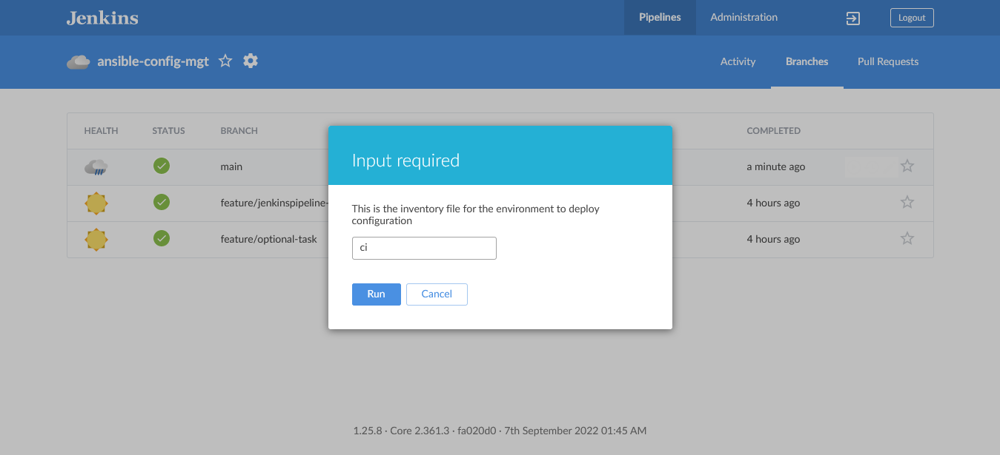

## CI/CD Pipeline for TODO application

### Phase 1 – Prepare Jenkins

- Fork the [todo repository](https://github.com/darey-devops/php-todo.git) into your GitHub account.

- Since we already Installed a community role for artifactory in the beginging of the project, we simply create an instance for Artifactory. Add the private ip address into inventory/ci enviroment and configure all settings in the playbook/site.yml, roles and static assignment so as to install Artifactory and run playbook against CI inventory to install Artifactory on our Jenkins Server
  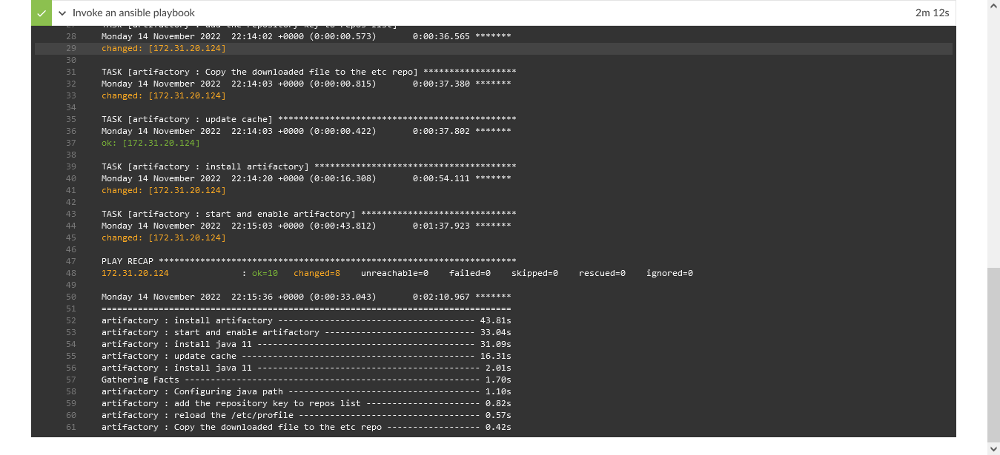

- For manual installation of Artifactory see this Guide on How to [ Configure Artifactory on Ubuntu 20.04](https://www.howtoforge.com/tutorial/ubuntu-jfrog/)

- Open port 8082 in artifactory security group

- Login into the Artifactory server `http://<artifactory-public-ip>:8082` and enter username and password (admin, password), create new password
  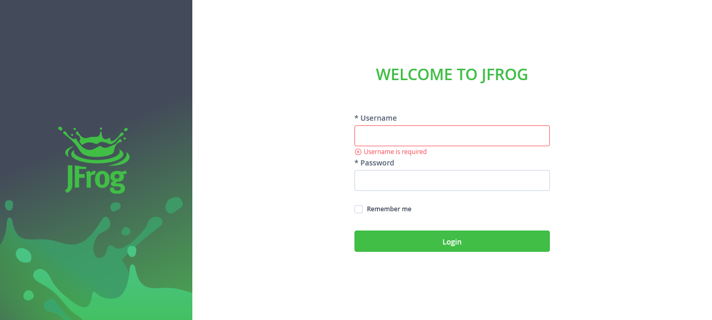

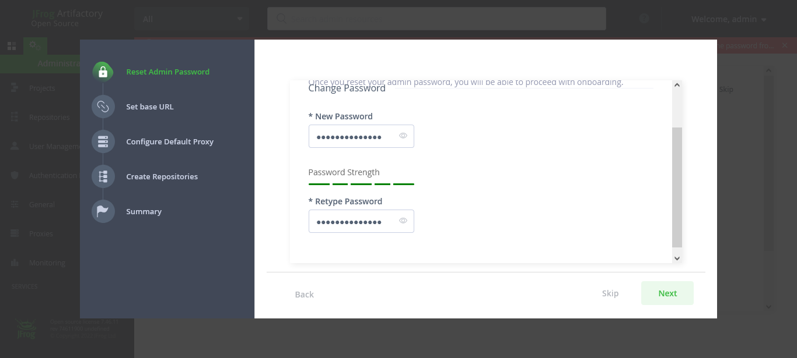

- Click on `Create repository`, `Select Package Type`, Choose `Generic`, enter `Repository Key` as `PBL`, save and finish.
  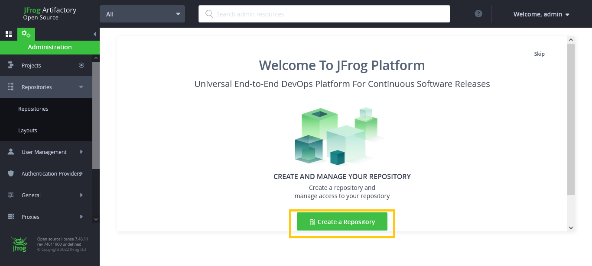
  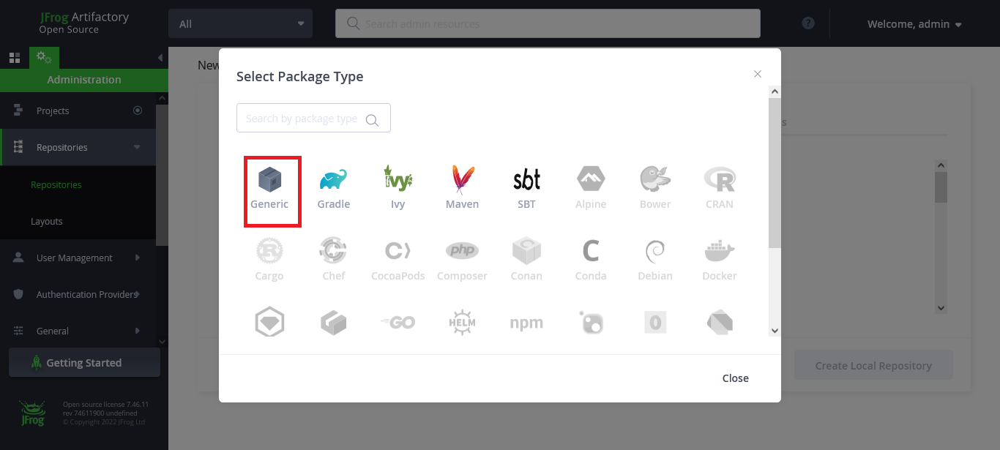

- On you Jenkins server, install PHP, its dependencies and Composer tool (Feel free to do this manually at first, then update your Ansible accordingly later)

```
  sudo apt install -y zip libapache2-mod-php phploc php-{xml,bcmath,bz2,intl,gd,mbstring,mysql,zip}
```

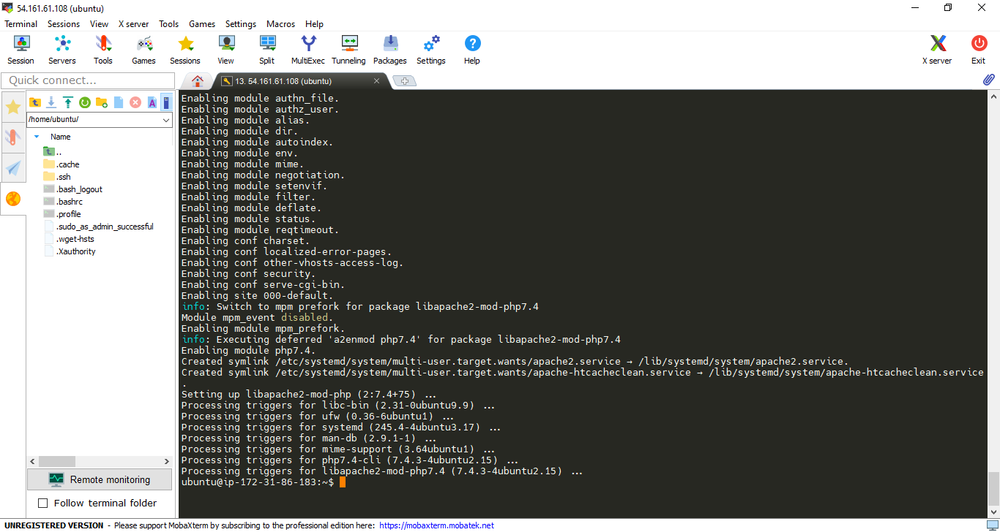

```
sudo php /tmp/composer-setup.php && sudo mv composer.phar /usr/bin/composer
```

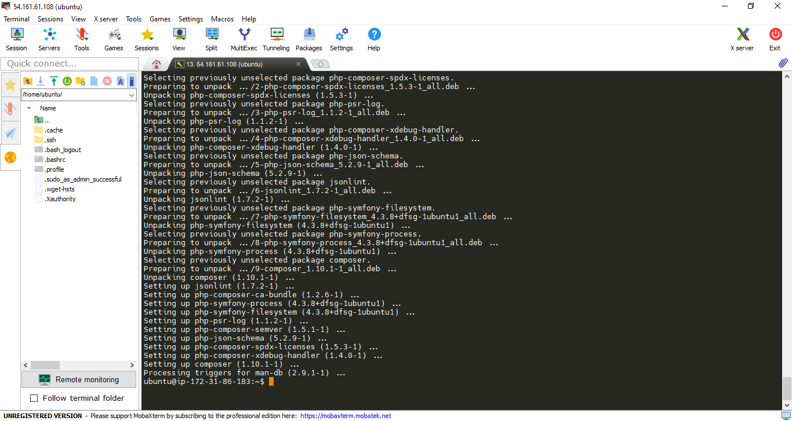
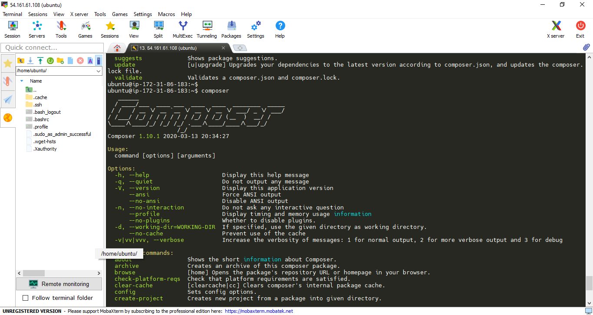

- Install Plot Plugins
  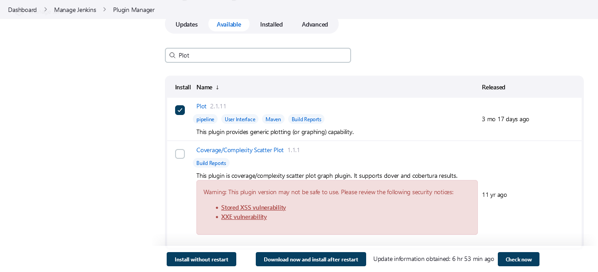

> This plugin provides generic plotting (or graphing) capabilities in Jenkins. It will plot one or more single values variations across builds in one or more plots. Plots for a particular job (or project) are configured in the job configuration screen, where each field has additional help information. Each plot can have one or more lines (called data series). After each build completes the plots’ data series latest values are pulled from the CSV file generated by phploc.

- Install Artifactory plugin
  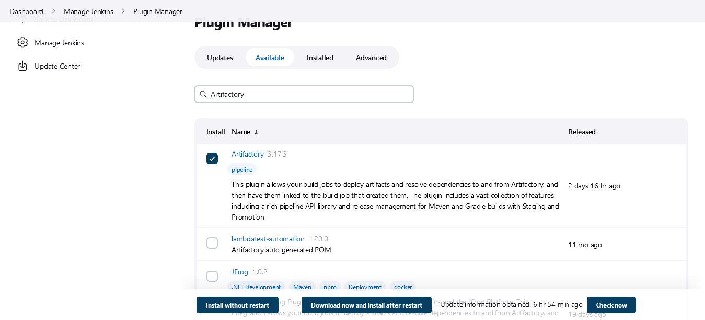

  > Artifactory plugin will be used to upload code artifacts into an Artifactory server.

- Enter the Jenkins UI to configure Artifactory,

  - from your Dashboard, click on `Manage Jenkins`, Click on `Configure System`, Select `Jfrog`
    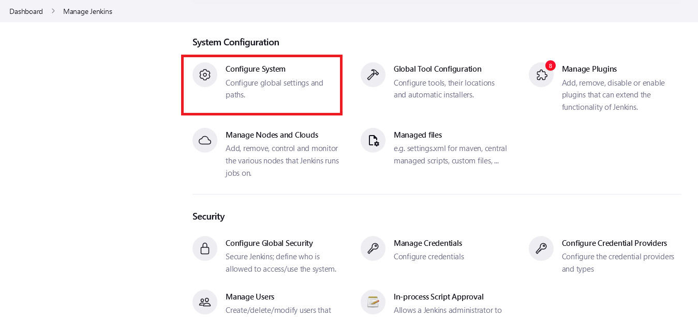

- Configure the server ID, URL and Credentials, run Test Connection.
  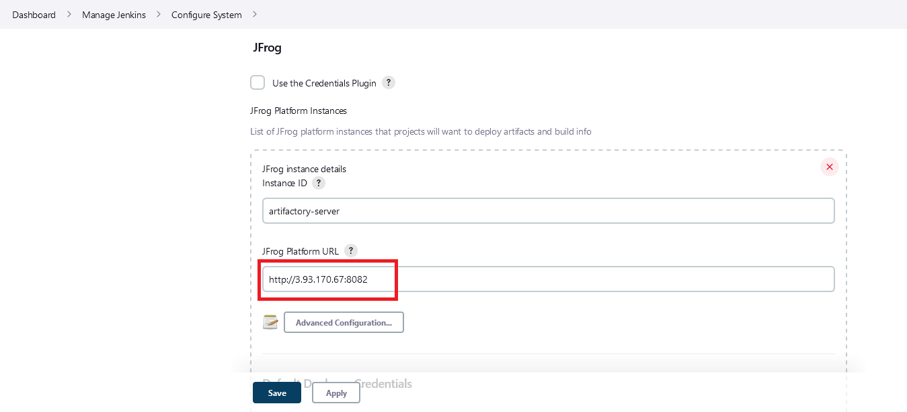

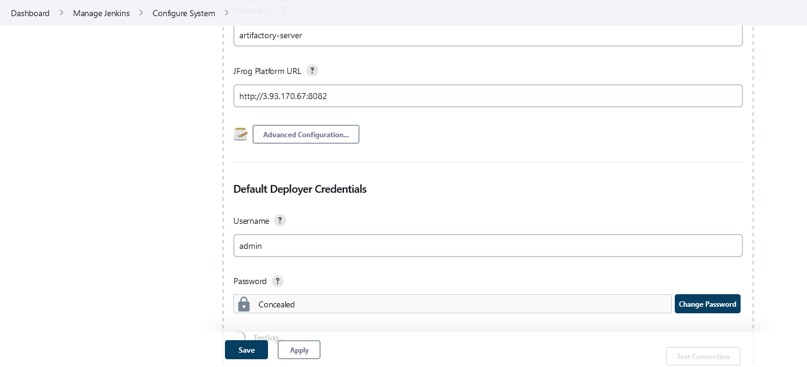

### Phase 2 – Integrate Artifactory repository with Jenkins

- On the database server, create database and user

```
Create database homestead;
CREATE USER 'homestead'@'%' IDENTIFIED BY 'Password123';
GRANT ALL PRIVILEGES ON * . * TO 'homestead'@'%';
```

- Update the database connectivity requirements in the file .env.sample
  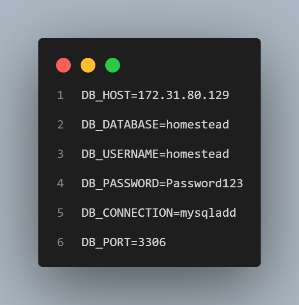

- Set the bind address of the database of the MYSQL server to allow connections from remote hosts.

```
sudo vi /etc/mysql/mysql.conf.d/mysqld.cnf
```

> Change bind-address = 0.0.0.0 and restart mysql

```
sudo systemctl restart mysql.
```

- Ensure you install mysql client on Jenkins

```
sudo apt install mysql-client.
```

- Create a Jenkinsfile in the cloned php-todo root directory and Update Jenkinsfile with proper pipeline configuration

```
pipeline {
    agent any

  stages {

     stage("Initial cleanup") {
          steps {
            dir("${WORKSPACE}") {
              deleteDir()
            }
          }
        }

    stage('Checkout SCM') {
      steps {
            git branch: 'main', url: 'https://github.com/Kingkellee/php-todo.git'
      }
    }

    stage('Prepare Dependencies') {
      steps {
             sh 'mv .env.sample .env'
             sh 'composer install'
             sh 'php artisan migrate'
             sh 'php artisan db:seed'
             sh 'php artisan key:generate'
      }
    }
  }
}
```

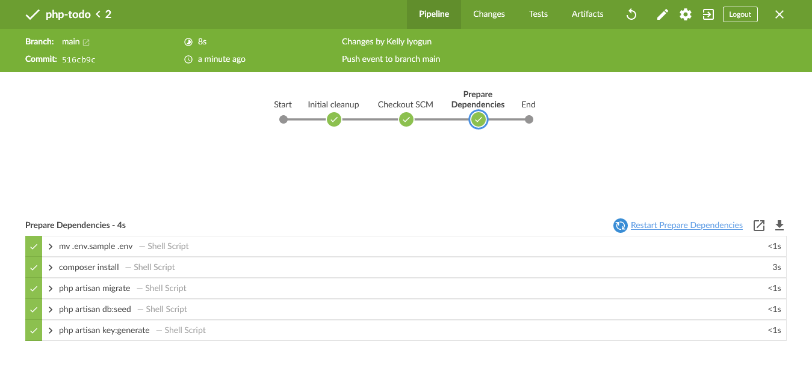

- Notice the Prepare Dependencies section,
  > The required file by PHP is .env so we are renaming .env.sample to .env

> Composer is used by PHP to install all the dependent libraries used by the application

> php artisan uses the .env file to setup the required database objects – (After successful run of this step, login to the database, run show tables and you will see the tables being created for you)
> 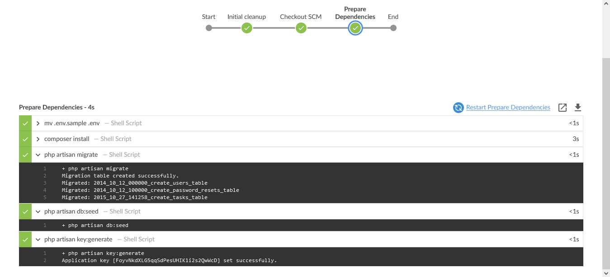

- Push the code and build (it should be done in the php-todo folder), ensure the parameter is in dev.

- To check if the database were created, launch the database instance.
  run:

```
sudo mysql
show databases;
select user, host from mysql.user;
```

- Update the Jenkinsfile to include Unit tests step

```
stage('Execute Unit Tests') {
      steps {
             sh './vendor/bin/phpunit'
      }
}
```

### Phase 3 – Code Quality Analysis

> Code Quality Analysis is one area where developers, architects and many stakeholders are mostly interested in as far as product development is concerned. As a DevOps engineer you will be required to setup the tools neccessary to run Code QA, For PHP the most commonly tool used for code quality analysis is phploc. [Read the article for more information](https://matthiasnoback.nl/2019/09/using-phploc-for-quick-code-quality-estimation-part-1/). The data produced by phploc can be ploted onto graphs in Jenkins.

- Add code analysis step in Jenkinsfile. The output of the data will be saved in `build/logs/phploc.csv` file.

```
stage('Code Analysis') {
  steps {
        sh 'phploc app/ --log-csv build/logs/phploc.csv'

  }
}
```

- Plot the data using plot Jenkins plugin.

```
    stage('Plot Code Coverage Report') {
      steps {

            plot csvFileName: 'plot-396c4a6b-b573-41e5-85d8-73613b2ffffb.csv', csvSeries: [[displayTableFlag: false, exclusionValues: 'Lines of Code (LOC),Comment Lines of Code (CLOC),Non-Comment Lines of Code (NCLOC),Logical Lines of Code (LLOC)                          ', file: 'build/logs/phploc.csv', inclusionFlag: 'INCLUDE_BY_STRING', url: '']], group: 'phploc', numBuilds: '100', style: 'line', title: 'A - Lines of code', yaxis: 'Lines of Code'
            plot csvFileName: 'plot-396c4a6b-b573-41e5-85d8-73613b2ffffb.csv', csvSeries: [[displayTableFlag: false, exclusionValues: 'Directories,Files,Namespaces', file: 'build/logs/phploc.csv', inclusionFlag: 'INCLUDE_BY_STRING', url: '']], group: 'phploc', numBuilds: '100', style: 'line', title: 'B - Structures Containers', yaxis: 'Count'
            plot csvFileName: 'plot-396c4a6b-b573-41e5-85d8-73613b2ffffb.csv', csvSeries: [[displayTableFlag: false, exclusionValues: 'Average Class Length (LLOC),Average Method Length (LLOC),Average Function Length (LLOC)', file: 'build/logs/phploc.csv', inclusionFlag: 'INCLUDE_BY_STRING', url: '']], group: 'phploc', numBuilds: '100', style: 'line', title: 'C - Average Length', yaxis: 'Average Lines of Code'
            plot csvFileName: 'plot-396c4a6b-b573-41e5-85d8-73613b2ffffb.csv', csvSeries: [[displayTableFlag: false, exclusionValues: 'Cyclomatic Complexity / Lines of Code,Cyclomatic Complexity / Number of Methods ', file: 'build/logs/phploc.csv', inclusionFlag: 'INCLUDE_BY_STRING', url: '']], group: 'phploc', numBuilds: '100', style: 'line', title: 'D - Relative Cyclomatic Complexity', yaxis: 'Cyclomatic Complexity by Structure'
            plot csvFileName: 'plot-396c4a6b-b573-41e5-85d8-73613b2ffffb.csv', csvSeries: [[displayTableFlag: false, exclusionValues: 'Classes,Abstract Classes,Concrete Classes', file: 'build/logs/phploc.csv', inclusionFlag: 'INCLUDE_BY_STRING', url: '']], group: 'phploc', numBuilds: '100', style: 'line', title: 'E - Types of Classes', yaxis: 'Count'
            plot csvFileName: 'plot-396c4a6b-b573-41e5-85d8-73613b2ffffb.csv', csvSeries: [[displayTableFlag: false, exclusionValues: 'Methods,Non-Static Methods,Static Methods,Public Methods,Non-Public Methods', file: 'build/logs/phploc.csv', inclusionFlag: 'INCLUDE_BY_STRING', url: '']], group: 'phploc', numBuilds: '100', style: 'line', title: 'F - Types of Methods', yaxis: 'Count'
            plot csvFileName: 'plot-396c4a6b-b573-41e5-85d8-73613b2ffffb.csv', csvSeries: [[displayTableFlag: false, exclusionValues: 'Constants,Global Constants,Class Constants', file: 'build/logs/phploc.csv', inclusionFlag: 'INCLUDE_BY_STRING', url: '']], group: 'phploc', numBuilds: '100', style: 'line', title: 'G - Types of Constants', yaxis: 'Count'
            plot csvFileName: 'plot-396c4a6b-b573-41e5-85d8-73613b2ffffb.csv', csvSeries: [[displayTableFlag: false, exclusionValues: 'Test Classes,Test Methods', file: 'build/logs/phploc.csv', inclusionFlag: 'INCLUDE_BY_STRING', url: '']], group: 'phploc', numBuilds: '100', style: 'line', title: 'I - Testing', yaxis: 'Count'
            plot csvFileName: 'plot-396c4a6b-b573-41e5-85d8-73613b2ffffb.csv', csvSeries: [[displayTableFlag: false, exclusionValues: 'Logical Lines of Code (LLOC),Classes Length (LLOC),Functions Length (LLOC),LLOC outside functions or classes ', file: 'build/logs/phploc.csv', inclusionFlag: 'INCLUDE_BY_STRING', url: '']], group: 'phploc', numBuilds: '100', style: 'line', title: 'AB - Code Structure by Logical Lines of Code', yaxis: 'Logical Lines of Code'
            plot csvFileName: 'plot-396c4a6b-b573-41e5-85d8-73613b2ffffb.csv', csvSeries: [[displayTableFlag: false, exclusionValues: 'Functions,Named Functions,Anonymous Functions', file: 'build/logs/phploc.csv', inclusionFlag: 'INCLUDE_BY_STRING', url: '']], group: 'phploc', numBuilds: '100', style: 'line', title: 'H - Types of Functions', yaxis: 'Count'
            plot csvFileName: 'plot-396c4a6b-b573-41e5-85d8-73613b2ffffb.csv', csvSeries: [[displayTableFlag: false, exclusionValues: 'Interfaces,Traits,Classes,Methods,Functions,Constants', file: 'build/logs/phploc.csv', inclusionFlag: 'INCLUDE_BY_STRING', url: '']], group: 'phploc', numBuilds: '100', style: 'line', title: 'BB - Structure Objects', yaxis: 'Count'

      }
    }
```

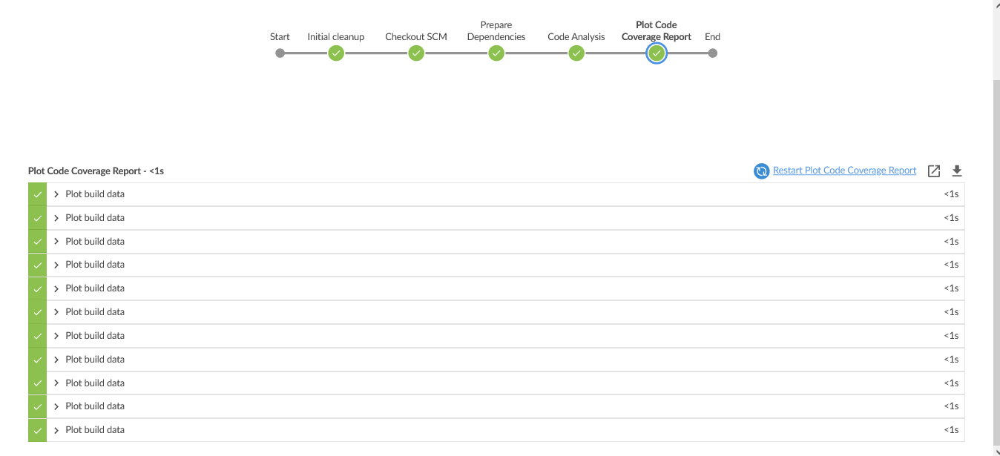

> You should now see a Plot menu item on the left menu. Click on it to see the charts

- Bundle the application code for into an artifact (archived package) upload to Artifactory

```
  stage ('Package Artifact') {
      steps {
              sh 'zip -qr php-todo.zip ${WORKSPACE}/*'
      }
  }
```

- Publish the resulted artifact into Artifactory

```
  stage ('Upload Artifact to Artifactory') {
          steps {
            script {
                 def server = Artifactory.server 'artifactory-server'
                 def uploadSpec = """{
                    "files": [
                      {
                       "pattern": "php-todo.zip",
                       "target": "<name-of-artifact-repository>/php-todo",
                       "props": "type=zip;status=ready"

                       }
                    ]
                 }"""

                 server.upload spec: uploadSpec
               }
            }

  }
```

> Our target <name-of-artifact-repository> is the name of our Jfrog repositroy-key createed earlier

- Deploy the application to the dev environment by launching Ansible pipeline

```
  stage ('Deploy to Dev Environment') {
      steps {
      build job: 'ansible-project/main', parameters: [[$class: 'StringParameterValue', name: 'env', value: 'dev']], propagate: false, wait: true
      }
  }
```

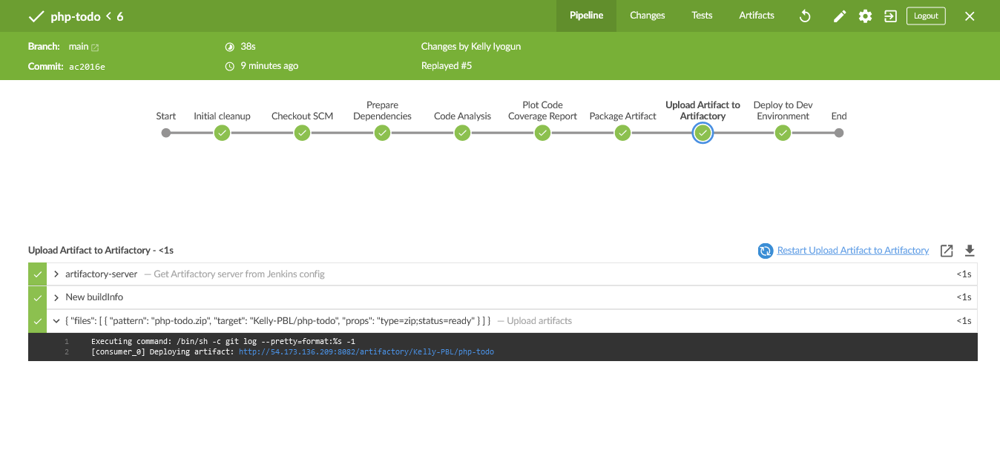

> The build job used in this step tells Jenkins to start another job. In this case it is the ansible-project job, and we are targeting the main branch. Hence, we have ansible-project/main. Since the Ansible project requires parameters to be passed in, we have included this by specifying the parameters section. The name of the parameter is env and its value is dev. Meaning, deploy to the Development environment.

- Note, Deploy our artifacts codes from php-todo repository, we need to configure the deployment.yml.

  - Our url can be gotten from our created jfrog artifactory
    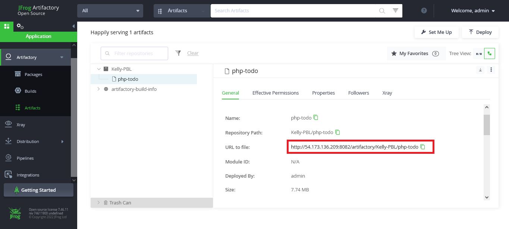

  - Generate a password from the Artifactory server, to get the password, click `Set Me Up` and enter `default password`
    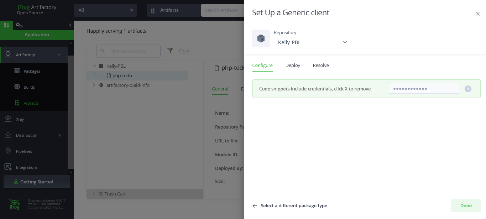
  - goto deploy and copy the password
    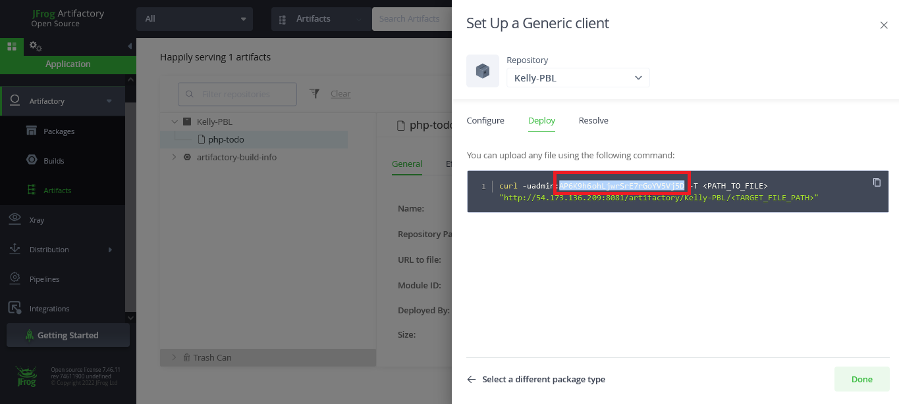

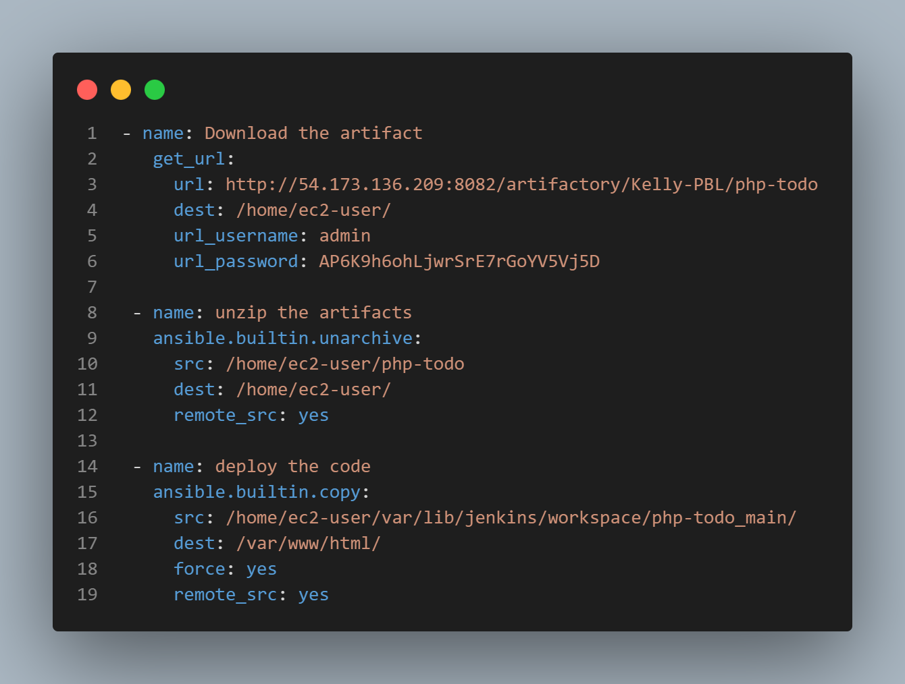

## Configure SonarQube and Jenkins For Quality Gate

- Create a role for sonarqube via ansible galaxy for installation of Sonarqube or manually create a sonarqube role

- Create an instance for Sonarqube, the minimum requirement is 4GB RAM and 2 vCPUs and update the Ip details in ansible-config inventory/ci and site.yml for complete installation.

- Open port 9000 in in Sonarqube security group

- To run the command we need to update the `roles_path` in `ansible.cfg` located in the deploy folder, just for the purpose of the Sonarqube installation set `roles_path=/home/ubuntu/ansible-config/roles.`
- After updating the `roles_path` in the `ansible.cfg`,
  enter the following command in the terminal:

```
export ANSIBLE_CONFIG=/home/ubuntu/ansible-config/deploy/ansible.cfg
```

- Ensure the ansible machine can talk to the server via SSH agent, by confirming ssh-add -l

- Run ansible-playbook ansible-playbook -i inventory/ci playbooks/site.yml on the command line

- In Jenkins, install SonarScanner plugin
  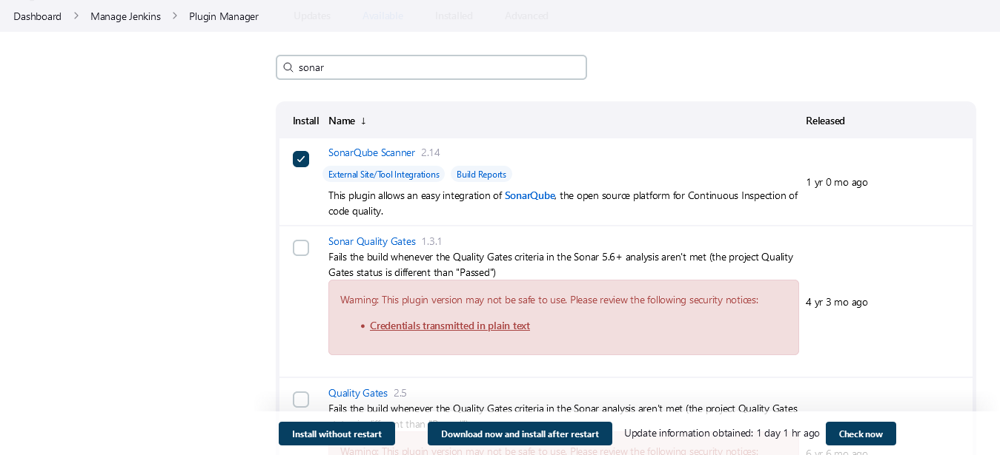

- Navigate to `configure system` in Jenkins. Add SonarQube server in `Manage Jenkins` > `Configure System`
  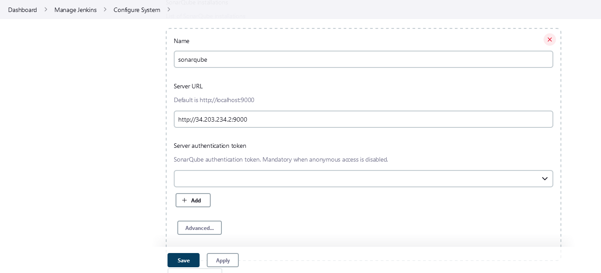
- Connect to sonarqube instance via port 9000, password and username is `admin`.
  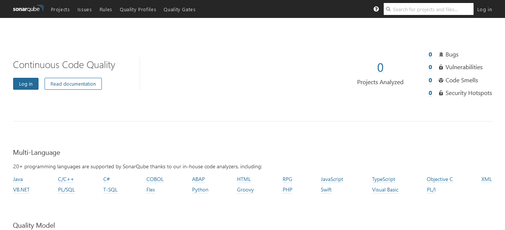

- Generate authentication token in SonarQube `User` > `My Account` > `Security` > `Generate Tokens`
  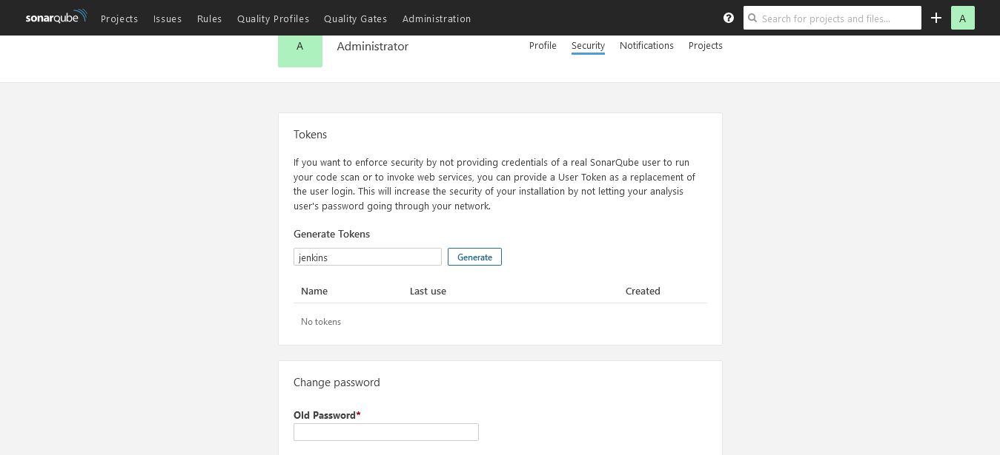
  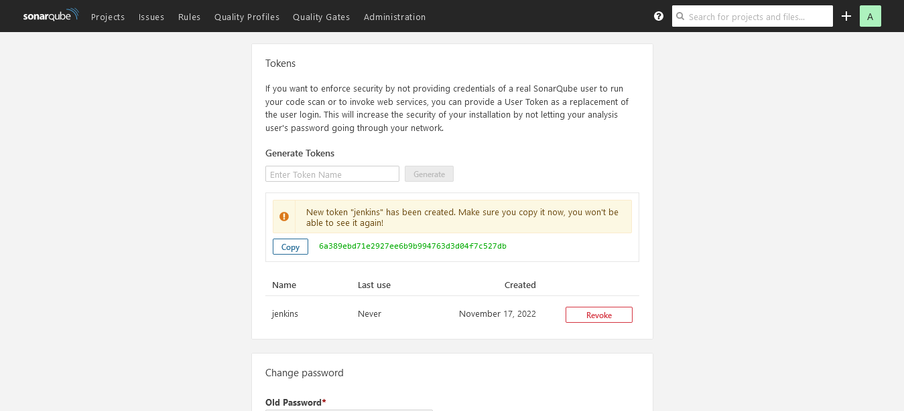

- Configure Quality Gate Jenkins Webhook in SonarQube, note The URL should point to your Jenkins server `http://{JENKINS_HOST}/sonarqube-webhook/`

  - Click on `Administration`
  - Click on `Configuration`, selct `Webhook` from the dropdown
    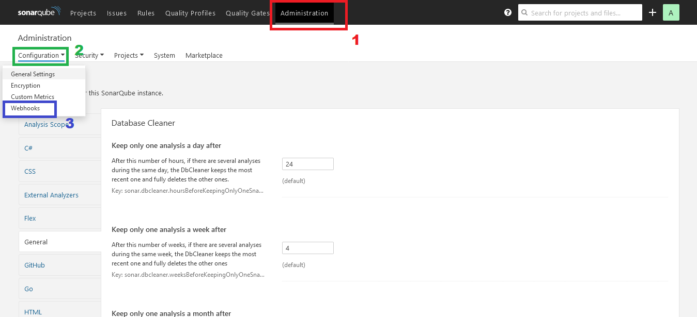
  - Enter Default Name, for URL: <PUBLIC-JENKINS-IP>:8080/sonarqube-webhook/, Secret: <Generated-Sonarqube-Token> Click Create
    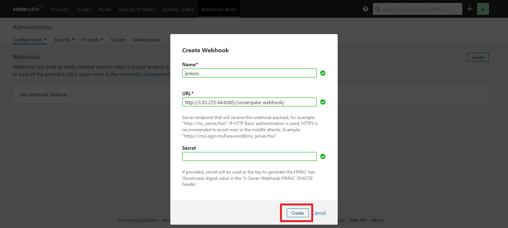

- Setup SonarQube scanner from Jenkins – Global Tool Configuration

  - Goto `Manage Jenkins` > `Global Tool Configuration` edit as follows
    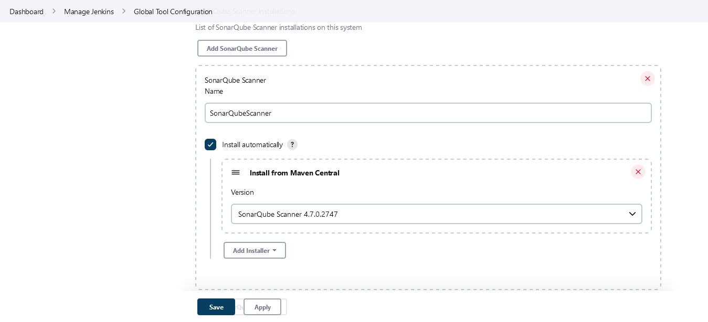

- Update Jenkins Pipeline to include SonarQube scanning and Quality Gate, this should be placed after `Code Coverage Report` and before `Upload Artifact` Stage, because we do not want our artifsact to be upload if our quality gate stage fails

```
  stage('SonarQube Quality Gate') {
        environment {
            scannerHome = tool 'SonarQubeScanner'
        }
        steps {
            withSonarQubeEnv('sonarqube') {
                sh "${scannerHome}/bin/sonar-scanner"
            }

        }
  }
```

- Push the changes to the remote php-todo repo

  > NOTE: The above step will fail because we have not updated `sonar-scanner.properties`

- `Configure sonar-scanner.properties` – From the previous step, Jenkins will install the `scanner tool` on the Linux server.

- Go into the SonarScanner tools directory on the server

```
  cd /var/lib/jenkins/tools/hudson.plugins.sonar.SonarRunnerInstallation/SonarQubeScanner/conf/
```

- Configure the properties file in which SonarQube will require to function during pipeline execution.

  - Open sonar-scanner.properties file

  ```
  sudo vi sonar-scanner.properties
  ```

  - Add configuration related to php-todo project

  ```
    sonar.host.url=http://<SonarQube-Server-IP-address>:9000
    sonar.projectKey=php-todo
    #----- Default source code encoding
    sonar.sourceEncoding=UTF-8
    sonar.php.exclusions=**/vendor/**
    sonar.php.coverage.reportPaths=build/logs/clover.xml
    sonar.php.tests.reportPath=build/logs/junit.xml
  ```

- Re start the Build

- The quality gate we just included has no effect because if you go to the SonarQube UI, We just pushed a poor-quality code onto the development environment.
  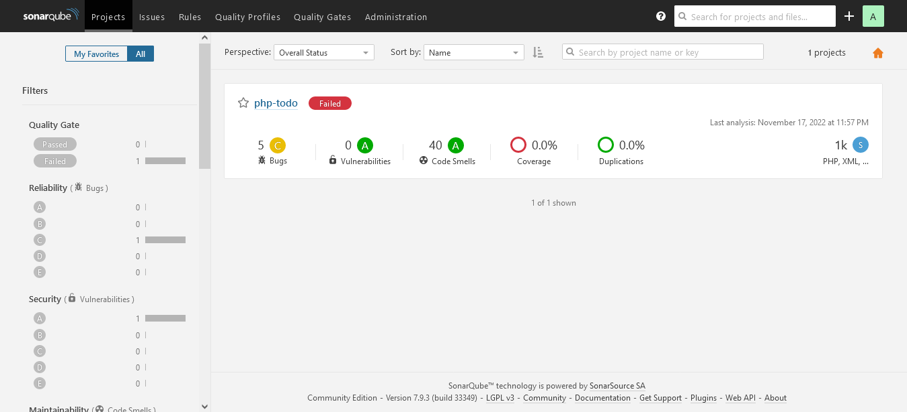
  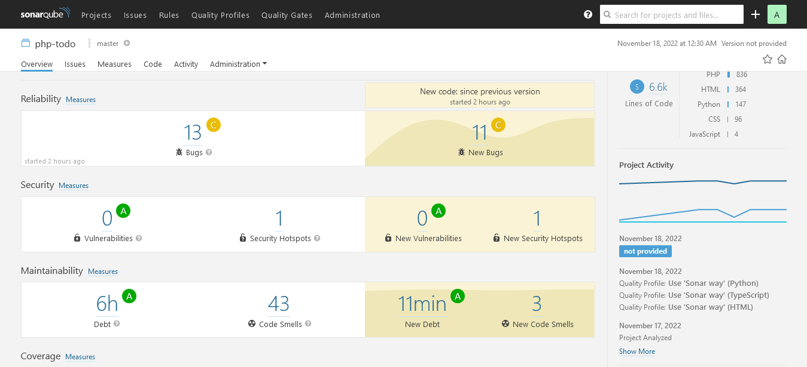

> In the development environment, this is acceptable as developers will need to keep iterating over their code towards perfection. But as a DevOps engineer working on the pipeline, we must ensure that the quality gate step causes the pipeline to fail if the conditions for quality are not met.

- Assuming a basic gitflow implementation restricts only the develop branch to deploy code to Integration environment like sit.

- We will update our Jenkinsfile to implement this using:

```
    stage('SonarQube Quality Gate') {
      when { branch pattern: "^develop*|^hotfix*|^release*|^main*", comparator: "REGEXP"}
        environment {
            scannerHome = tool 'SonarQubeScanner'
        }
        steps {
            withSonarQubeEnv('sonarqube') {
                sh "${scannerHome}/bin/sonar-scanner -Dproject.settings=sonar-project.properties"
            }
            timeout(time: 1, unit: 'MINUTES') {
                waitForQualityGate abortPipeline: true
            }
        }
    }
```

- To test, create different branch and push to GitHub. You will realise that only branches other than develop, hotfix, release, main, or master will be able to deploy the code.
  - If everything goes well, you should be able to see something like this
    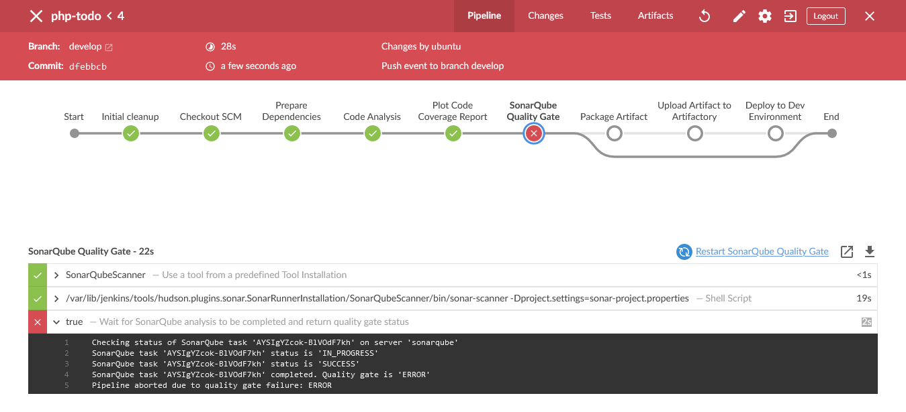

> Note with the current state of the code, it cannot be deployed to Integration environments due to its quality. In the real world, DevOps engineers will push this back to developers to work on the code further, based on SonarQube quality report. Once everything is good with code quality, the pipeline will pass and proceed with sipping the codes further to a higher environment.

#

# Video Showing the Pipeline Run

https://user-images.githubusercontent.com/55467245/202891188-ce549b9e-c2e5-4bd9-a6cc-bbd4809b89de.mp4
